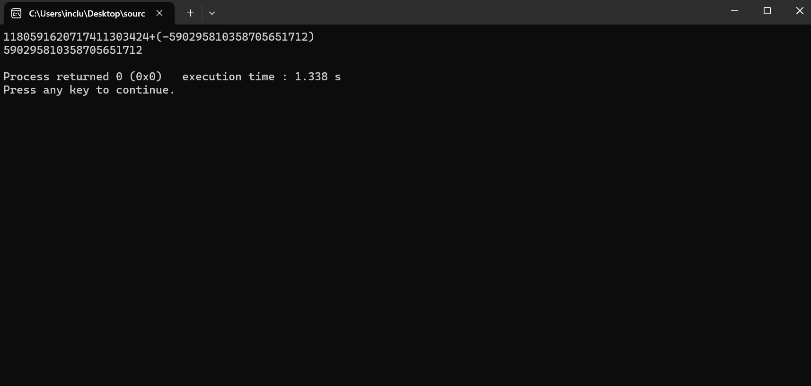

# CS-MEDIUM-01 大数运算

## Part 1 理解大数运算

### Q1.为什么要使用字符数组来表示大数？

首先，高精度算法适用于所运算数据超过最大数据类型所能表示的**最大数值范围**的计算，而高精度算法本质上是在**模拟**人工进行四则运算时采用的**竖式计算**。

由于竖式计算本质上就是**按位**来进行数值运算操作的一种方法，那么，在设计高精度算法时，选择用数组来存储数字的**每一位数**，然后在计算时有序遍历数组的每一个元素来模拟竖式计算中按位计算的过程，就是一个非常自然的想法。

### Q2.如何处理大数运算中的进位和借位问题？

乘法和加法中处理进位的过程，实际上是先对得数的每一位进行**不进位**的直接计算，然后再把**大于十**的部分加到下一位，最后再除去本位多于十的部分。

减法的借位也是类似的，先对每一位进行**不借位**的减法，如果本位小于零，再从前一位减少十加到本位。

至于除法，其具体实现过程其实是**若干次的减法**，借位问题的处理和减法也是一样的。

### Q3.如何处理负数

处理负数的方法首先是对负数进行**「标记」**，可以用数组的第 0 位来表示是否为负数，也可以专门用一个变量来表示这个数字是否为负数。

在四则运算中，如果含有负数，就要进行**「符号的运算」**，比如在加减法中，减去负数相当于加上负数的绝对值，加上负数相当于减去负数的绝对值等等，这些就需要额外进行判断，而乘除法相对简单，只要注意负负得正即可。

## Part2.初步实现大数运算

### Step 1 尝试存储大数

详细代码见 `source_code` 文件夹

### Step 2 实现大数加法

详细代码见 `source_code` 文件夹

### Step 3 实现大数加法（处理负数）

详细代码见 `source_code` 文件夹

## Part 3 从表达式中提取操作数和操作符

*说明：由于样例输入存在有**空格**，因此本程序的提取方法是针对**有空格的输入**，**无空格的输入的提取方法见 Part4 代码**。*

详细代码见 `source_code` 文件夹

## Part 4 封装大数四则运算

详细代码见 `source_code` 文件夹
